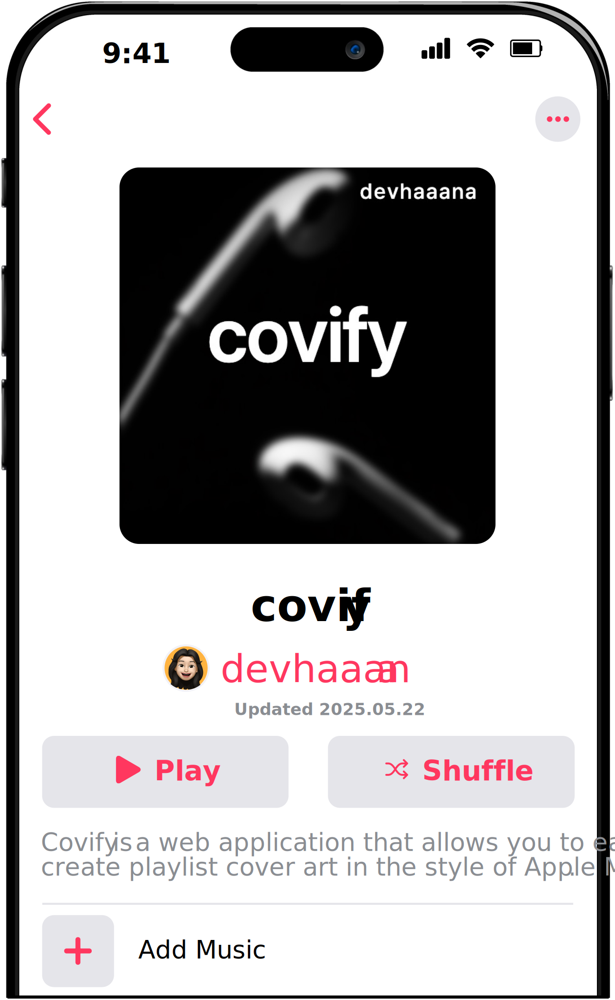
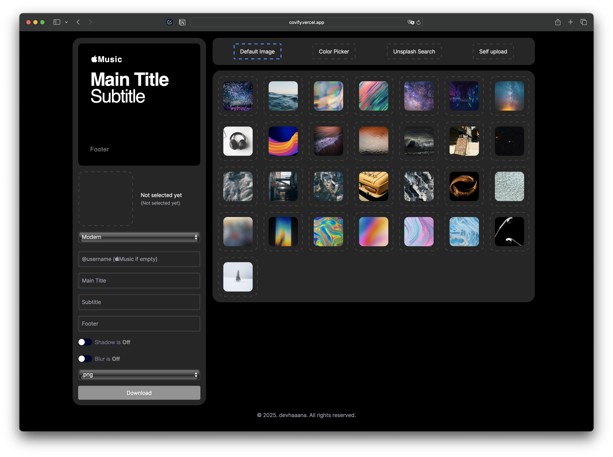

  

  
  
  
  

 

[ENGLISH](/README.md)  ·  [한국어](/documents/README-KR.md)  ·  [日本語](/documents/README-JP.md)

 

`Covify` is a web application that allows you to easily create playlist cover art in the style of Apple Music.
You can combine text, images, and colors to design your own aesthetic playlist cover, and download it directly.
Built as a static web app, it runs quickly and smoothly in the browser without any installation.

## Index

- [Index](#index)
- [Warning](#warning)
- [Technologies](#technologies)
- [Getting Started](#getting-started)
  - [Usage](#usage)
- [Release Files](#release-files)

## Warning

**Please do not use this project for commercial use. Only for your personal, non-commercial use.**

**Note:** Due to the API's hourly request limit, some features may experience temporary interruptions.

## Technologies

- `HTML`
- `CSS`
- `JS`

## Getting Started

### Usage

Visit the following link to use Covify in your browser:

[https://covify.vercel.app](https://covify.vercel.app/)

No installation required - simply combine text, images, and colors to create and download your own playlist cover art.

## Release Files

| File                                                                                    | Description                                                        |
| :-------------------------------------------------------------------------------------- | :----------------------------------------------------------------- |
| [covify-1.1.0.zip](https://github.com/devhaaana/covify/archive/refs/tags/v1.1.0.zip)       | A*ZIP* file containing the full source code of covify v1.1.0.    |
| [covify-1.1.0.tar.gz](https://github.com/devhaaana/covify/archive/refs/tags/v1.1.0.tar.gz) | A*TAR.GZ* file containing the full source code of covify v1.1.0. |