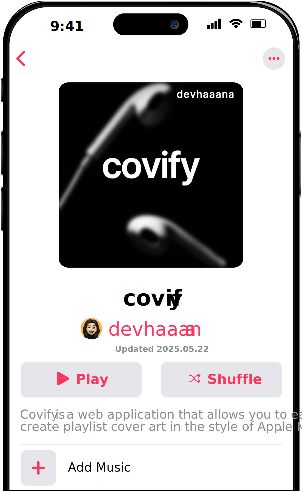

  

  
  
  
  

 

[ENGLISH](/README.md)  ·  [한국어](/documents/README-KR.md)  ·  [日本語](/documents/README-JP.md)

 

`covify`는 애플 뮤직 스타일의 플레이리스트 커버 아트를 손쉽게 생성할 수 있는 웹 애플리케이션입니다. 텍스트, 이미지, 색상을 조합해 자신만의 감성적인 플레이리스트 커버를 만들고, 다운로드 할 수 있습니다. 정적 웹을 활용해 가볍고 빠르게 작동하며, 별도의 설치 없이 브라우저에서 바로 사용할 수 있습니다.

## 인덱스

- [인덱스](#인덱스)
- [경고](#경고)
- [사용 기술](#사용-기술)
- [시작하기](#시작하기)
  - [사용 방법](#사용-방법)
- [릴리스 파일](#릴리스-파일)

## 경고

**이 프로젝트를 상업적인 용도로 사용하지 마십시오. 개인적, 비상업적인 용도로만 사용해 주세요.**

**참고:** API의 시간당 요청 제한으로 인해 일부 기능이 일시적으로 원활하지 않을 수 있습니다.

## 사용 기술

- `HTML`
- `CSS`
- `JS`

## 시작하기

### 사용 방법

웹 브라우저에서 다음 링크를 열어 바로 사용할 수 있습니다:

[https://covify.vercel.app](https://covify.vercel.app/)

별도의 설치 없이, 텍스트·이미지·색상을 조합해 커버 아트를 만들고 다운로드할 수 있습니다.

## 릴리스 파일

| 파일                                                                                    | 설명                                                        |
| :-------------------------------------------------------------------------------------- | :----------------------------------------------------------------- |
| [covify-1.0.0.zip](https://github.com/devhaaana/covify/archive/refs/tags/v1.0.0.zip)       | covify v1.0.0의 전체 소스 코드가 포함된 *ZIP* 파일    |
| [covify-1.0.0.tar.gz](https://github.com/devhaaana/covify/archive/refs/tags/v1.0.0.tar.gz) | covify v1.0.0의 전체 소스 코드가 포함된 *TAR.GZ* 파일 |